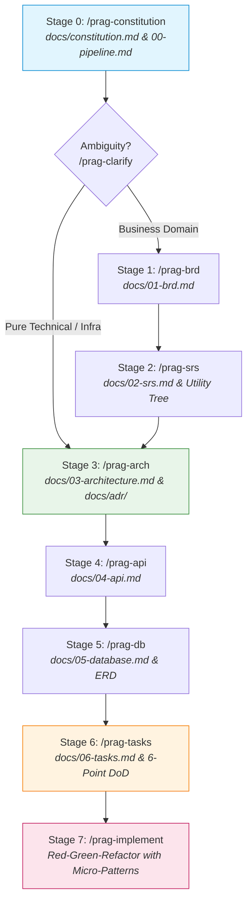

# Pragmatic Software Design: Spec & Architecture-First AI Engineering Governance

> A rigorous yet pragmatic Software Engineering & Architecture skill suite for Agentic AI (Google Antigravity, Gemini CLI, Claude Code, Cursor, Copilot). Eliminates "vibe coding" through 11 discrete, human-in-the-loop skills (`/prag-*`) that bridge enterprise-grade rigor (BRD, SRS, Utility Tree, ADD, SAD, API Contracts, DBDD, ADR) with hyper-fast developer velocity.

---

## 1. Why This Exists: The Three Paradigms

```text
┌─────────────────────────┐     ┌─────────────────────────┐     ┌─────────────────────────┐
│       Vibe Coding       │     │    Agile / Spec-Kit     │     │ Pragmatic Architecture  │
├─────────────────────────┤     ├─────────────────────────┤     ├─────────────────────────┤
│ • Unguided chat prompts │     │ • Feature-level slices  │     │ • Foundation & System   │
│ • Hallucinated schemas  │     │ • Fast for tiny tasks   │     │   blueprint first       │
│ • Brittle architecture │     │ • Lacks NFR metrics     │     │ • Utility Tree + ADD    │
│ • Unmaintainable code   │     │ • Architecture erosion  │     │ • Mermaid C4 & ERD      │
│ • Zero review gates     │     │ • Heavy Python CLI tool │     │ • Human-in-the-loop     │
│                         │     │ • Hidden dotfiles       │     │ • First-class docs/     │
└─────────────────────────┘     └─────────────────────────┘     └─────────────────────────┘
```

1. **Vibe Coding (Unguided Prompts)**: Developers prompt AI on the fly without constraints. Produces fragmented context, schema drift, telescoping constructors, nested switch-case hell, and eventual codebase collapse.
2. **Agile Feature-Driven (e.g., GitHub Spec-Kit)**: A step forward by requiring specs before code. However, it operates purely on micro feature slices without establishing an upfront system foundation. It lacks quantified Non-Functional Requirements (NFRs), ignores architectural trade-offs, and relies on heavy Python CLI tooling (`specify-cli`, `uv`) and hidden internal dotfiles (`.specify/`).
3. **Pragmatic Architecture First (This Framework)**: Establishes the system constitution, domain invariants, database blueprint, and macro design patterns *before* code implementation. It stores clean, first-class documentation directly in `docs/` for both humans and AI, and enforces strict **Human-in-the-Loop review gates**.

---

## 2. Core Philosophy & Architectural Pillars

### 2.1 Spec Supremacy & Zero-Fluff
* **Code Serves Specifications; Specifications Do Not Serve Code**: Source code is an ephemeral realization of ratified blueprints. No business logic or database column may be implemented without upstream approval.
* **Human-in-the-Loop Governance**: The AI is forbidden from running unbroken full-lifecycle generation. Each skill inspects its prerequisite gate in `docs/00-pipeline.md`, guides the engineer milestone by milestone, and **STOPS** for explicit human sign-off.

### 2.2 The 5 Universal Boundary Invariants
Regardless of language, framework, or business domain, every project governed by this framework strictly enforces 5 boundary rules:
1. **Zero-Colocation Rule**: Entities (`model/`), Request/Response schemas (`dto/`), Handlers/Controllers (`handler/`), and Business Logic (`service/`) MUST NEVER be colocated in the same file or shared directory.
2. **2-Model Boundary Discipline**: Dedicated transport DTOs strictly isolate public API contracts from internal database models, preventing mass-assignment vulnerabilities and accidental data leaks.
3. **Self-Describing Package Names**: Directory and package names must unambiguously declare their single responsibility. Catch-all junk drawers (`util`, `helper`, `common`, `platform`, `shared`, `misc`) are strictly banned.
4. **Repository Isolation**: Repositories represent atomic aggregate boundaries and **MUST NEVER** call other repositories. Inter-entity coordination belongs strictly to the Service/Orchestrator layer.
5. **Dependency Inversion**: Core business logic depends on abstractions, never on low-level database drivers, external SDKs, or transport protocols.

### 2.3 Pragmatic Design Pattern Adoption (Article 8)
Patterns are tools for **simplification and decoupling**, not intellectual decoration. The framework introduces a disciplined **2-Tier Pattern Strategy** backed by a strict anti-over-engineering guardrail:

* **Tier 1: Macro Design Patterns (Architectural Design Phase / Stage 3 SAD)**:
  * *Service Orchestrator / Facade*: Coordinates multi-aggregate transactional workflows (e.g., Checkout coordinating Order, Payment, and Inventory) to eliminate circular cross-service calls.
  * *Adapter*: Wraps third-party vendor SDKs (AWS S3, Stripe, Twilio) behind domain-owned interfaces in `infra/` to insulate core business logic.
  * *Provider Strategy / Factory*: Enables runtime pluggability for multi-provider subsystems (e.g., swapping payment gateways or storage engines via configuration).
  * *Event-Driven Pub/Sub*: Decouples asynchronous side-effects (notifications, audit logging) from the primary request-response pipeline.
* **Tier 2: Micro Design Patterns (Implementation Phase / Stage 6 Code)**:
  * *Functional Options (Go) / Builder (TS/Python)*: Resolves constructor parameter creep when instantiating structs/objects with > 3 optional configurations.
  * *Strategy / Table-Driven Dispatch*: Replaces expanding `switch/case` ladders or `if/else` branching trees over types or statuses with clean dispatch tables.
  * *Middleware / Decorator*: Extracts cross-cutting concerns (telemetry, authentication, distributed tracing, rate-limiting) without polluting business handlers.
* **Anti-Over-Engineering Guardrail (KISS & YAGNI First)**:
  * Strictly forbidden for straightforward linear CRUD flows with no branching complexity.
  * Never introduce an abstract Factory or Strategy interface for a capability with only **one concrete implementation** and no foreseeable variation.

### 2.4 Canonical Production Benchmark (`references/go-project-structure.md`)
The framework provides an industry-grade reference blueprint at [`references/go-project-structure.md`](file:///references/go-project-structure.md):
* **Go Backend Services**: Ingest and align 100% with this flat layered layout. Leverages idiomatic **Consumer-Driven Interfaces** (unexported interfaces declared at the consumer package, concrete structs exported by producers).
* **Other Stacks (TypeScript, Python, Java, C#)**: Use this blueprint as the canonical decoupling model, adapting interface placement to nominal typing paradigms (e.g., interfaces placed in dedicated domain/ports packages).

---

## 3. Enterprise Standards Mapped to Lean Artifacts

| Enterprise Standard | Engineering Purpose | Lean Artifact in `docs/` | What Is Preserved & Compressed |
| :--- | :--- | :--- | :--- |
| **Constitution** | Core principles, quality gates & stack rules | `docs/constitution.md` | **8 Non-Negotiable Articles**, stack specialization, zero secrets, structured logging, universal boundary invariants, and pragmatic pattern adoption. |
| **BRD** *(CMMI-DEV v2.0 / ISO 29148)* | Business goals, scope limits, rules & traceability | `docs/01-brd.md` | Measurable Objectives (`BO-xxx`), In/Out Scope, RACI Matrix, AS-IS vs TO-BE, Business Rules (`BU-R-xxx`), and Bidirectional Traceability Matrix. |
| **SRS** *(ISO/IEC/IEEE 29148 / IEEE 830)* | Functional specs, system behavior, data retention | `docs/02-srs.md` | Formal requirements in **EARS Syntax** (Ubiquitous, Event, State, Error, Optional), state machines, external interface specs. |
| **Utility Tree** *(ATAM)* | Quantifying quality attributes (Latency, Scale, HA) | `docs/02-srs.md` | **Quality Attribute Scenarios Matrix** with measurable Stimulus → Response targets and Priority weights. |
| **SAD & ADD** *(ISO 42010 / ADD)* | Architectural tactics, C4 diagrams, capacity sizing | `docs/03-architecture.md` | **Mermaid C4 Diagrams** (Context & Container), 4-Tier Layering, Section 3.5 **Macro Design Patterns**, Capacity Math, and Complexity Defense Table. |
| **API Contract** *(OpenAPI 3.1)* | RESTful contracts, DTO schemas, error envelopes | `docs/04-api.md` | Public endpoints, JSON schemas, RFC 7807 Problem Details, Centralized Error Code Dictionary, ETag optimistic locking, deprecation lifecycle. |
| **DBDD & ERD** *(IEEE 1016)* | Physical schema, tables, types, indexing & constraints | `docs/05-database.md` | **Mermaid ERD**, column Data Dictionary, connection pool sizing math, pessimistic/optimistic locking, ESR indexing, zero-downtime migration checklist. |
| **Tasks Checklist** *(WBS)* | Work breakdown and execution tracking | `docs/06-tasks.md` | Phased markdown checklist with `[P]` (parallelizable) markers, blocking Foundation Gate, and strict 6-point Definition of Done (DoD). |
| **ADR** *(MADR 3.0 / ISO 42010)* | Recording architectural decisions & trade-offs | `docs/adr/ADR-xxx.md` | Discrete MADR records capturing technical context, Olaf Zimmermann Y-Statements, evaluated options, trade-offs, and validation criteria. |

---

## 4. Directory Layout

All governance and architecture blueprints live directly in the visible `<project-root>/docs/` directory:

```text
<project-root>/
├── docs/                             # Visible engineering specifications & governance
│   ├── constitution.md               # 8 Non-negotiable architectural articles & quality gates
│   ├── 00-pipeline.md                # Project Engineering Pipeline & Stage Status Dashboard
│   ├── 01-brd.md                     # Business Requirements Document (SEI CMMI-DEV v2.0 / ISO 29148)
│   ├── 02-srs.md                     # Software Requirements Specification (ISO 29148 / EARS / Utility Tree)
│   ├── 03-architecture.md            # System Architecture Document (C4 Model, Macro Patterns, ADD Tactics)
│   ├── 04-api.md                     # API Specification (RESTful Contracts, RFC 7807, Error Dictionary)
│   ├── 05-database.md                # Database Design Document (Mermaid ERD + DBDD Physical Data Dictionary)
│   ├── 06-tasks.md                   # Phased execution checklist with [P] parallel flags & 6-point DoD
│   └── adr/                          # Discrete Architectural Decision Records (MADR 3.0 format)
│       ├── ADR-0001-language-runtime.md
│       ├── ADR-0002-orchestration.md
│       └── ADR-0003-persistence-engine.md
├── migrations/                       # Deterministic SQL schema migrations (up/down)
└── src/ (or internal/ for Go)        # Source code strictly mirroring architecture blueprints
```

---

## 5. The 11 Discrete Skills Suite

The suite provides 11 focused skills organized by engineering stage. Each skill enforces a dedicated scope guard, checks prerequisite gates, and halts for review:

| Stage / Skill | Primary Target | Standards & Methodology | Gate Action |
| :--- | :--- | :--- | :--- |
| **Stage 0**<br>`/prag-constitution` | `docs/constitution.md`<br>`docs/00-pipeline.md` | 8 Core Articles, Stack conventions, Pipeline state machine init | **STOPS** for review |
| **Elicitation**<br>`/prag-clarify` | Chat / Ambiguity Log | 6 Ambiguity Dimensions (1 focused question at a time) | Waits for response |
| **Governance**<br>`/prag-status` | `docs/00-pipeline.md` | Pipeline health inspection, Gate blockers, Stage sign-offs | Unlocks next stage |
| **Stage 1**<br>`/prag-brd` | `docs/01-brd.md` | CMMI-DEV v2.0 (RD/REQM), ISO 29148, SMART Business Objectives | **STOPS** for review |
| **Stage 2**<br>`/prag-srs` | `docs/02-srs.md` | ISO 29148, IEEE 830, EARS Syntax, ATAM Utility Tree | **STOPS** for review |
| **Stage 3**<br>`/prag-arch` | `docs/03-architecture.md`<br>`docs/adr/ADR-xxx.md` | ISO 42010, C4 Model L1/L2, Macro Design Patterns, Capacity Math | **STOPS** for review |
| **Stage 4**<br>`/prag-api` | `docs/04-api.md` | OpenAPI 3.1, RFC 7807 Problem Details, Error Code Dictionary | **STOPS** for review |
| **Stage 5**<br>`/prag-db` | `docs/05-database.md` | IEEE 1016 DBDD, Connection Pool Math, ESR Indexing, Mermaid ERD | **STOPS** for review |
| **Stage 6**<br>`/prag-tasks` | `docs/06-tasks.md` | Work Breakdown Structure (WBS), `[P]` markers, 6-Point DoD | **STOPS** for review |
| **Stage 7**<br>`/prag-implement` | Source Code | Interactive Scope Gate, Test-First, Micro-Pattern Refactoring, `-race` | Confirms scope before code |
| **Ad-Hoc**<br>`/prag-adr` | `docs/adr/ADR-xxx.md` | MADR 3.0.0, ISO 42010, Olaf Zimmermann Y-Statement | **STOPS** for review |

---

## 6. End-to-End Governance Workflow



### Collaborative Section Stepper (Default Protocol)
Skills operate as interactive workshops between human and AI rather than silent generators:
1. **Interactive Milestone Discussions**: At each stage, the AI presents options, structural designs, and trade-offs in chat.
2. **Explicit Write Commands**: Files are only updated when the human engineer explicitly commands (*"viết doc phần này"*, *"chốt"*, *"save section"*).
3. **Fast-Track Override**: If the user explicitly asks for instant generation (*"gen cả file docs luôn đi"*), the AI drafts the entire document in a single pass.
4. **In-Place Canonical Editing**: Updates modify the canonical files in-place. Historical versions are managed strictly through Git.

---

## 7. The 6-Point Definition of Done (DoD)

Before any task in `docs/06-tasks.md` can transition from `- [ ]` to `- [x]`, the AI agent must verify all 6 criteria:
1. **Clean Compilation & Anti-Smell Cleanliness**: 0 syntax errors, builds cleanly. Code smells resolved via pragmatic micro-patterns (Functional Options, Table-driven dispatch, Middleware) without over-engineering.
2. **Race-Detector Test Pass**: All automated tests pass with race detection enabled (`go test -race ./...`, `pytest`, `npm test`).
3. **Explicit Error Discipline**: Every error path explicitly checked and wrapped with contextual info; 0 silent failures or swallowed exceptions.
4. **Linter Cleanliness**: 0 warnings under standard linters (`golangci-lint`, `ruff`, `eslint`).
5. **Zero Secrets**: No hardcoded API keys, tokens, or credentials; verified against `.env.example`.
6. **Contract Fidelity**: Conforms 100% to `docs/04-api.md` (status codes, envelopes) and `docs/05-database.md` (constraints, index usage).

---

## 8. Supported Ecosystems & Technology Matrix

The framework enforces clean 4-tier layering (`Router` → `Handler` → `Service` → `Repository`) with idiomatic adaptations for modern runtimes:

| Principle / Concern | Go 1.24+ (Primary Benchmark) | Python 3.12+ (FastAPI / AsyncIO) | TypeScript / Node.js 22 LTS |
| :--- | :--- | :--- | :--- |
| **Package Management** | `go modules` (`go.mod`) | `uv` / `poetry` (`pyproject.toml`) | `pnpm` / `npm` (`package.json`) |
| **Interface Style** | **Consumer-Driven** (declared at consumer) | Protocols / Abstract Base Classes | Domain/Ports interfaces |
| **Test Runner** | `go test -race ./...` (table-driven) | `pytest -v` (`pytest-asyncio`) | `node:test` / `vitest run` |
| **Structured Logging** | `log/slog` or `zerolog` (JSON) | `structlog` or `logging` (JSON) | `pino` or `winston` (JSON) |
| **Configuration** | `os.Getenv` strongly typed parser | `pydantic-settings` | `zod` + `process.env` validation |
| **Micro Patterns** | Functional Options, Dispatch Map | Builder, Dependency Injection | Builder, Middleware chains |
| **Documentation** | GoDoc comments on exported symbols | PEP 257 Docstrings | TSDoc / JSDoc standards |

---

## 9. Installation & Getting Started

### 9.1 Global Installation (Antigravity & Gemini CLI)
Run the automated installer to symlink all 11 skills into `~/.gemini/config/skills/`:

```bash
git clone https://github.com/giakiet05/pragmatic-software-design.git
cd pragmatic-software-design
./scripts/install.sh --global
```

### 9.2 Workspace-Specific Installation
To install the skill suite into an isolated workspace:

```bash
./scripts/install.sh --workspace /path/to/my-project
```

### 9.3 Uninstallation
To cleanly remove all global symlinks:

```bash
./scripts/install.sh --uninstall
```

---

## 10. Quick Start Walkthrough

1. **Initialize Governance**:
   ```text
   /prag-constitution
   ```
   *Establishes the 8 non-negotiable architectural articles in `docs/constitution.md` and initializes `docs/00-pipeline.md`.*

2. **Elicit Requirements & Ambiguities**:
   ```text
   /prag-clarify
   ```
   *Resolves edge cases across 6 ambiguity dimensions (1 question at a time).*

3. **Author Specifications (Business / Software)**:
   ```text
   /prag-brd    # Draft business requirements and measurable objectives
   /prag-srs    # Author EARS functional specifications and ATAM Utility Tree
   ```

4. **Design System Architecture & Discrete ADRs**:
   ```text
   /prag-arch
   ```
   *Produces Mermaid C4 diagrams, validates boundary invariants against `references/go-project-structure.md`, selects Macro Design Patterns, and generates discrete ADRs in `docs/adr/`.*

5. **Define Contracts & Physical Schemas**:
   ```text
   /prag-api    # Produces OpenAPI 3.1 REST contracts and RFC 7807 error catalogs
   /prag-db     # Author Mermaid ERD, column data dictionaries, and ESR indexing
   ```

6. **Decompose & Implement**:
   ```text
   /prag-tasks      # Generate phased task checklist with [P] parallelism
   /prag-implement  # Execute tasks test-first with race detection and micro-pattern refactoring
   ```

7. **Track Pipeline Health**:
   ```text
   /prag-status     # Inspect current stage, blockers, and record human sign-offs
   ```

---

## 11. Technical Rules & Language Protocol

* **100% English Codebase**: Source code, variable names, documentation comments, commit messages, and internal log keys are strictly in **English**. Decorative emojis are banned.
* **Bilingual Interaction**: Conversational interactions and human documentation narratives seamlessly adapt to the developer's language (Tiếng Việt or English).
* **Git Commit Hygiene**: All commits adhere strictly to 1-line Conventional Commits: `<type>(<scope>): <short description in English>`.

---

**Author & Maintainer**: Gia Kiệt ([@giakiet05](https://github.com/giakiet05))  
**License**: MIT
