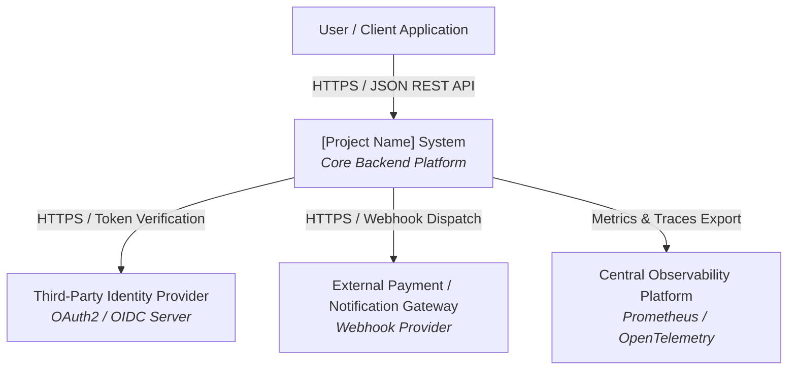
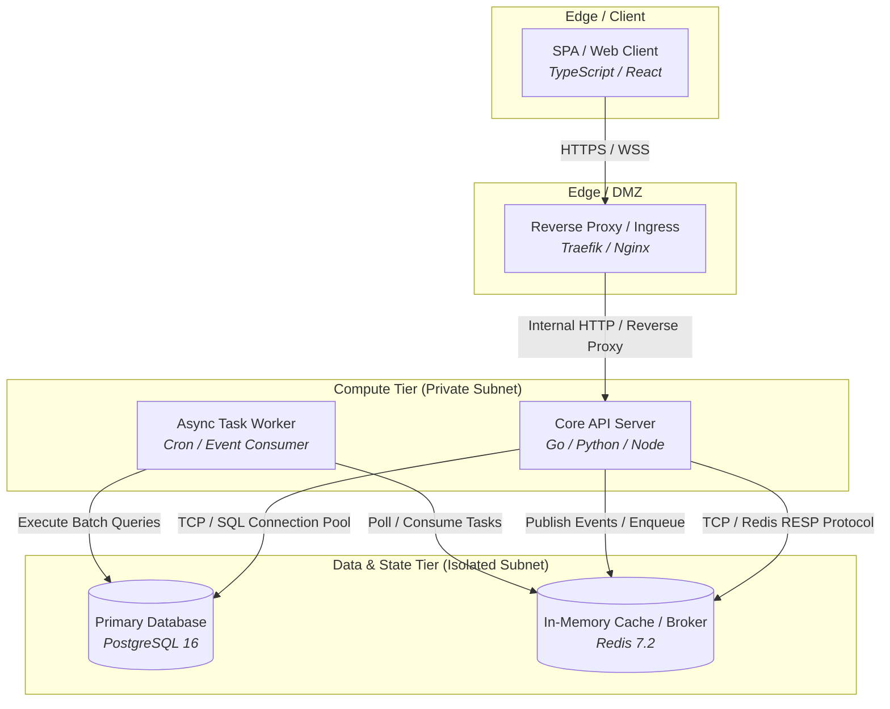
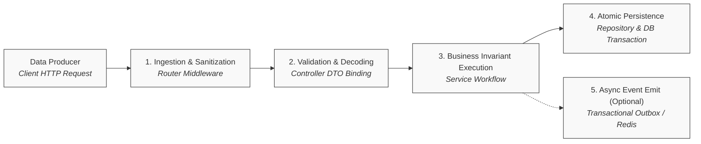
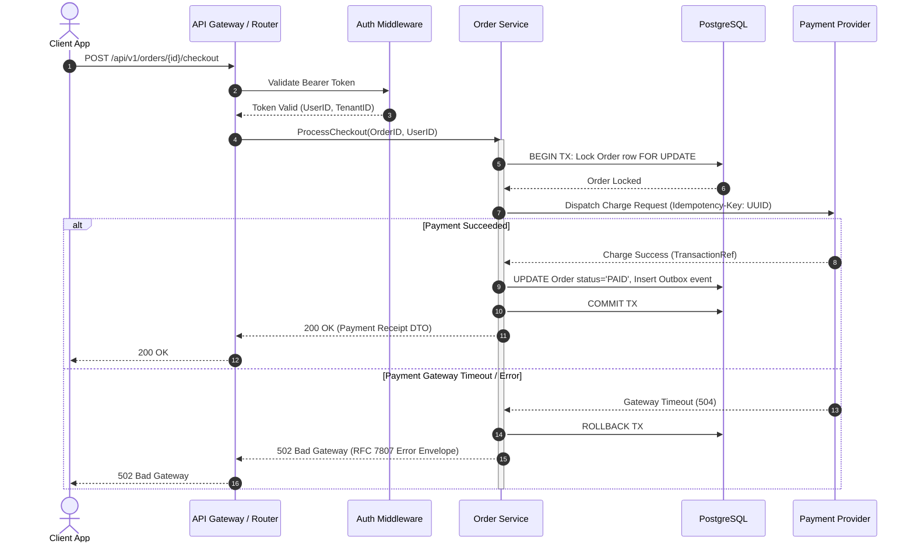

<!--
[AI AGENT DIRECTIVE: PRAGMATIC TEMPLATE ADAPTATION]
1. DOMAIN FIDELITY: This document is a structural and semantic guide. You MUST adapt all entities, terminology, state transitions, and architectures strictly to the USER'S ACTUAL SYSTEM DOMAIN. NEVER copy placeholder examples (e.g., e-commerce orders, payments) unless they are genuinely required by the user's domain.
2. PRAGMATIC PRUNING (YAGNI): Tailor depth and complexity to the project's scale. If a specific advanced architectural pattern (e.g., Table Partitioning, WebSockets, Circuit Breakers, Complex Multi-region DR) is demonstrably over-engineered for the current scope, explicitly mark it as "N/A - Omitted because [concrete technical reason]" rather than fabricating unnecessary complexity.
3. ZERO PLACEHOLDER LEAKS: Replace all [BRACKETED_PLACEHOLDERS] with real, concrete project data. Never leave unpopulated template tags in the final generated document.
-->

# System Architecture Document (SAD): [PROJECT NAME]

> **Document Identifier**: SAD-[PROJECT]-001  
> **Document Version**: 1.0.0  
> **Standard Compliance**: IEEE 42010:2011, SEI Attribute-Driven Design (ADD) & C4 Model  
> **Derived From**: `docs/01-brd.md` & `docs/02-srs.md`  
> **Governing ADRs**: `docs/adr/*.md`  
> **Status**: [Draft | In Review | Approved | In Progress]  
> **Lead Systems Architect**: [Name / Role]  
> **Last Updated**: [YYYY-MM-DD]  

---

### Document Control & Revision History

| Version | Release Date | Author / Contributor | Summary of Changes | Approval Status |
| :---: | :---: | :--- | :--- | :---: |
| **0.1** | [YYYY-MM-DD] | [Lead Systems Architect] | Initial system architecture design and C4 models | Draft |
| **1.0** | [YYYY-MM-DD] | [Lead Systems Architect] | Architecture baseline ratified with HA/DR and capacity sizing | Approved |

---

## Table of Contents
- [1. Architecture Drivers & Constraints](#1-architecture-drivers--constraints)
  - [1.1 Key Quality Attribute Drivers (SLA/SLO Targets)](#11-key-quality-attribute-drivers-slaslo-targets)
  - [1.2 Non-Negotiable Technical Constraints](#12-non-negotiable-technical-constraints)
- [2. Technology Stack & Selection Matrix](#2-technology-stack--selection-matrix)
- [3. Architecture Style & Boundary Rules](#3-architecture-style--boundary-rules)
  - [3.1 Architectural Pattern](#31-architectural-pattern)
  - [3.2 Strict 4-Tier Layering Invariants](#32-strict-4-tier-layering-invariants)
  - [3.3 Architectural Guardrails (Forbidden Dependencies)](#33-architectural-guardrails-forbidden-dependencies)
  - [3.4 Unified Directory Layout](#34-unified-directory-layout)
- [4. Structural Views (C4 Model)](#4-structural-views-c4-model)
  - [4.1 System Context View (C4 Level 1)](#41-system-context-view-c4-level-1)
  - [4.2 Container View (C4 Level 2)](#42-container-view-c4-level-2)
  - [4.3 Component View (C4 Level 3 - Selective)](#43-component-view-c4-level-3---selective)
- [5. Dynamic, Data & Event Flow View](#5-dynamic-data--event-flow-view)
  - [5.1 Streamlined Data & Event Pipeline](#51-streamlined-data--event-pipeline)
  - [5.2 Core Interaction Sequences](#52-core-interaction-sequences-selective-technical-sequence-diagrams)
- [6. Capacity Planning & Scalability Horizons](#6-capacity-planning--scalability-horizons)
  - [6.1 Resource Sizing & Storage Growth Estimations](#61-resource-sizing--storage-growth-estimations)
  - [6.2 Scalability Horizons & Evolution Triggers](#62-scalability-horizons--evolution-triggers)
- [7. Cross-Cutting Tactics & High Availability / Disaster Recovery (HA/DR)](#7-cross-cutting-tactics--high-availability--disaster-recovery-hadr)
  - [7.1 Cross-Cutting Architectural Tactics (ADD)](#71-cross-cutting-architectural-tactics-attribute-driven-design)
  - [7.2 High Availability & Disaster Recovery (HA/DR)](#72-high-availability--disaster-recovery-hadr)
- [8. Deployment, Infrastructure & Rollout Strategy](#8-deployment-infrastructure--rollout-strategy)
  - [8.1 Network Topology & Zone Isolation](#81-network-topology--zone-isolation)
  - [8.2 Container Specifications & Resource Governance](#82-container-specifications--resource-governance)
  - [8.3 Rollout & Data Evolution Strategy](#83-rollout--data-evolution-strategy)
- [9. Appendix: Architectural Decision Records & Complexity Tracking](#9-appendix-architectural-decision-records--complexity-tracking)
  - [9.1 Index of Governing ADRs](#91-index-of-governing-adrs)
  - [9.2 Complexity Defense Table (KISS & YAGNI Enforcement)](#92-complexity-defense-table-kiss--yagni-enforcement)

---

## 1. Architecture Drivers & Constraints

This architecture is driven by the Quality Attributes (NFRs) defined in `docs/02-srs.md` (Section 4 & Section 5) and constrained by non-negotiable operational boundaries.

### 1.1 Key Quality Attribute Drivers (SLA/SLO Targets)
*   **Performance & Latency**: [e.g., P99 API response time < 150ms under peak load of 2,000 RPS].
*   **Availability**: [e.g., 99.9% uptime (<= 8.76 hours unscheduled downtime/year)].
*   **Fault Tolerance & RPO/RTO**: [e.g., RPO = 0 (zero committed transaction loss), RTO < 15 minutes].
*   **Security & Compliance**: [e.g., Zero-Trust internal network, strict Zero-Secrets policy, AES-256 at rest, TLS 1.3 in transit].

### 1.2 Non-Negotiable Technical Constraints
*   **Target Operating System**: Linux Ecosystem ([EndeavourOS / Ubuntu Server / Alpine Container]).
*   **Execution Runtime**: [e.g., Standalone statically-linked Linux binary / Containerized microservice].
*   **Hardware / Resource Ceiling**: [e.g., Max 4 vCPU, 8 GB RAM per instance on host machine / Cloud VM].
*   **Network & Environment**: [e.g., Runs behind corporate reverse proxy; external internet access restricted via egress firewall].

---

## 2. Technology Stack & Selection Matrix

<!--
  MANDATORY: Explicitly justify every core technology choice against viable alternatives.
  Prevent tech-stack drift and eliminate 'vibe coding' or unvetted library adoption.
-->

| Architectural Role / Tier | Technology Chosen | Version | Alternatives Considered | Selection Rationale | Inherent Trade-offs | Trade-off Defense / Mitigation | Governing ADR |
| :--- | :--- | :--- | :--- | :--- | :--- | :--- | :--- |
| **Core Backend Service** | [e.g., Go] | [e.g., 1.24+] | [e.g., Python, Node.js] | High concurrent throughput via lightweight goroutines, minimal memory footprint, single statically-linked binary deployment. | Verbose boilerplate code; explicit manual error checking overhead; lack of dynamic language flexibility. | Standardized project scaffolding, code generation tools, and strict linting minimize boilerplate overhead. | [`ADR-0001`](file:///docs/adr/0001-language-runtime.md) |
| **Relational Database** | [e.g., PostgreSQL] | [e.g., 16+] | [e.g., MySQL, MongoDB] | Native JSONB support, strict ACID compliance, advanced indexing (B-Tree, GIN), robust foreign key integrity. | Process-based connection model consumes significant memory per connection; requires careful vacuuming and tuning under write-heavy bursts. | Enforce connection pooling via pgxpool / PgBouncer; tune WAL archiving and maintain targeted partial indexes. | [`ADR-0003`](file:///docs/adr/0003-persistence-engine.md) |
| **Cache & In-Memory Store** | [e.g., Redis] | [e.g., 7.2+] | [e.g., Memcached, Local Cache] | Rich atomic data structures, high-performance sub-millisecond key-value lookups, built-in pub/sub and stream capabilities. | Additional network hop compared to local process memory; potential data loss on abrupt node termination if AOF flush lags. | Keep round-trip latency sub-millisecond within private subnet; enable AOF persistence with 1-second sync policy (appendfsync everysec). | [`ADR-0004`](file:///docs/adr/0004-cache-broker.md) |
| **Reverse Proxy / Ingress** | [e.g., Traefik / Nginx] | [e.g., Latest Alpine] | [e.g., Caddy, Envoy] | Battle-tested reverse proxy, minimal resource footprint, automated SSL termination, native container routing. | Dynamic configuration via container labels or CRDs can be harder to validate and debug than static text configs. | Maintain version-controlled docker-compose templates and verify routing rules via isolated staging environments. | [`ADR-0005`](file:///docs/adr/0005-ingress-proxy.md) |
| **Transport Protocol** | [e.g., RESTful HTTP/2] | [e.g., RFC 9113] | [e.g., gRPC, GraphQL] | Universal client interoperability, public OpenAPI specification ecosystem, native browser caching and CDN integration. | Higher payload serialization and bandwidth overhead compared to binary Protobuf serialization. | Enable Gzip/Brotli compression; reserve Protobuf/gRPC for high-throughput internal service-to-service calls in Phase 3. | [`ADR-0006`](file:///docs/adr/0006-transport-protocol.md) |

---

## 3. Architecture Style & Boundary Rules

### 3.1 Architectural Pattern
*   **Style**: [e.g., Modular Monolith / Pragmatic Layered Monolith / Event-Driven Microservices].
*   **Rationale**: [Explain why this style was chosen over alternatives based on team size, domain complexity, and scalability stage].

### 3.2 Strict 4-Tier Layering Invariants
All codebase interactions MUST respect the strict unidirectional dependency flow:
`Transport/Router` -> `Controller/Handler` -> `Service/Domain` -> `Repository/Adapter`.

```text
[HTTP / gRPC Client]
        │
        ▼
┌────────────────────────────────────────────────────────┐
│ 1. Transport & Router Tier (internal/router)           │
│    - URL routing, method validation, middleware chain  │
│    - Invariant: Zero business logic, zero direct DB    │
└───────────────────────┬────────────────────────────────┘
                        │ Passes Request Context / Raw DTO
                        ▼
┌────────────────────────────────────────────────────────┐
│ 2. Controller Tier (internal/controller)               │
│    - DTO validation, HTTP status mapping, serialization│
│    - Invariant: Calls Service interfaces only          │
└───────────────────────┬────────────────────────────────┘
                        │ Calls Domain Workflows
                        ▼
┌────────────────────────────────────────────────────────┐
│ 3. Service / Domain Tier (internal/service)            │
│    - Business invariants, transactions, orchestrations │
│    - Invariant: Agnostic of HTTP/Transport protocols   │
└───────────────────────┬────────────────────────────────┘
                        │ Injects Repository Interfaces
                        ▼
┌────────────────────────────────────────────────────────┐
│ 4. Repository Tier (internal/repository)               │
│    - SQL queries, connection pools, schema mapping     │
│    - Invariant: Zero business logic, zero HTTP context │
└───────────────────────┬────────────────────────────────┘
                        │ SQL / TCP
                        ▼
               [Database / Cache]
```

### 3.3 Architectural Guardrails (Forbidden Dependencies)
1.  **No Reverse Coupling**: Inner layers (`Service`, `Repository`) MUST NEVER import or reference outer layers (`Router`, `Controller`).
2.  **No Bypass**: The `Controller` tier MUST NEVER call the `Repository` or Database directly, bypassing domain validation.
3.  **Interface Segregation**: All cross-tier dependencies MUST depend on abstractions (interfaces/protocols) to ensure deterministic mockability during unit testing.
4.  **Transaction Encapsulation**: Database transactions (`BEGIN ... COMMIT/ROLLBACK`) MUST be managed at the `Service` layer boundary, not inside individual atomic repository queries.

### 3.4 Unified Directory Layout
```text
<project-root>/
├── docs/                             # Engineering specifications & blueprints
│   ├── 01-brd.md                     # Business Requirements Document (CMMI-DEV / ISO 29148)
│   ├── 02-srs.md                     # Software Requirements Specification (ISO 29148 / EARS)
│   ├── 03-architecture.md            # System Architecture Document (C4, Tactics, HA/DR)
│   ├── 04-api.md                     # API Specification (RESTful Contracts, Schemas)
│   ├── 05-database.md                # Database Design Document (Mermaid ERD + DBDD)
│   ├── 06-tasks.md                   # Phased execution checklist with [P] markers
│   └── adr/                          # Architectural Decision Records (MADR format)
├── migrations/                       # Deterministic SQL schema migrations (up/down)
└── src/ (or internal/ for Go)
    ├── router/                       # Routing tables, middleware pipelines
    ├── controller/                   # Request deserialization, status serialization
    ├── service/                      # Core business logic, domain rules, transactions
    ├── repository/                   # Interface-driven SQL queries, connection pools
    └── model/                        # Domain entities, value objects, request/response DTOs
```

---

## 4. Structural Views (C4 Model)

### 4.1 System Context View (C4 Level 1)
Illustrates how the system interacts with human actors and external software boundaries.



### 4.2 Container View (C4 Level 2)
Decomposes the system into deployable units, specifying communication protocols and persistence stores.



### 4.3 Component View (C4 Level 3 - Selective)
<!--
  RULE: Only author C4 Level 3 Component Views for complex, mission-critical subsystems
  (e.g., Transaction Engine, Rule Evaluation Engine). Do not generate for simple CRUD modules.
-->
*   **Subsystem Identified for Component Decomposition**: [e.g., `Payment & Order Orchestrator` / `None - Standard 4-Tier Layering Applies`].
*   **Component Structure**: [Detail component breakdown using inline mermaid or text; omit if standard 4-tier layering applies].

---

## 5. Dynamic, Data & Event Flow View

### 5.1 Streamlined Data & Event Pipeline
<!-- Replaces legacy multi-level DFDs with a lean, end-to-end data transformation pipeline -->



### 5.2 Core Interaction Sequences (Selective Technical Sequence Diagrams)
<!--
  RULE: Strictly OPTIONAL/SELECTIVE. Author ONLY for complex flows involving >= 3 components,
  distributed state changes, external webhooks, or multi-step error compensations.
  DO NOT draw sequence diagrams for basic synchronous CRUD endpoints.
-->

#### Critical Flow 1: [e.g., Authenticated Payment Processing & Webhook Ingestion]


---

## 6. Capacity Planning & Scalability Horizons

### 6.1 Resource Sizing & Storage Growth Estimations
*   **Target Throughput Baseline**: [e.g., 500 RPS nominal, 2,500 RPS peak].
*   **Database Storage Velocity**:
    *   Estimated record creation rate: [e.g., 50,000 orders / day].
    *   Payload footprint per record: [e.g., ~2.5 KB with indexes].
    *   Monthly Storage Expansion: `50,000 * 2.5 KB * 30 days` = **~3.75 GB / month** (excluding logs).
    *   Annual Storage Baseline: **~45 GB / year** -> Initial disk allocation: 100 GB NVMe with auto-growth alerts at 80%.
*   **In-Memory Working Set (Cache Sizing)**:
    *   Active working set: [e.g., 20% of daily active items = 10,000 keys].
    *   Average cache entry size: [e.g., 4 KB].
    *   Required Cache RAM: `10,000 * 4 KB * 1.5 (Redis overhead)` = **~60 MB RAM** (Safe under default 1 GB instance).

### 6.2 Scalability Horizons & Evolution Triggers
Defines concrete thresholds for transitioning architecture as scale demands increase:

| Horizon / Stage | Load Threshold Trigger | Architectural Strategy & Interventions |
| :--- | :--- | :--- |
| **Phase 1: Single Node (Current)** | Up to 1,000 RPS / 50 GB Data | Vertical scaling. Optimize DB indexes, connection pooling (max 50 conns), in-memory cache for hot reads. |
| **Phase 2: Scale-Out Stateless Tier** | 1,000 - 5,000 RPS | Scale compute instances behind Load Balancer. Offload session state completely to Redis. Introduce PostgreSQL Read Replica for read-heavy reporting queries. |
| **Phase 3: Data Partitioning Tier** | > 5,000 RPS / > 500 GB Data | Implement database horizontal partitioning / sharding by `tenant_id` or `created_at`. Introduce dedicated event streaming queue (Kafka / RabbitMQ). |

---

## 7. Cross-Cutting Tactics & High Availability / Disaster Recovery (HA/DR)

### 7.1 Cross-Cutting Architectural Tactics (Attribute-Driven Design)

| Quality Attribute | Architectural Tactic Chosen | Implementation Details & Configuration |
| :--- | :--- | :--- |
| **Authentication & Authorization** | Stateless JWT + Scoped RBAC | Ed25519 or RS256 signature verification. Token lifetime: Access Token (15 min), Refresh Token (7 days, rotated on use). |
| **Caching Policy** | Cache-Aside with Invalidation Triggers | Redis cache layer with TTL (5 min default). Immediate write-through cache eviction on `UPDATE` / `DELETE` via service hooks. |
| **Resilience & Fault Tolerance** | Circuit Breaker + Exponential Backoff | Wrap all external third-party calls with circuit breaker: Trip after 5 consecutive failures, 30s half-open cooldown. Retry budget: 3 attempts with full jitter. |
| **Rate Limiting** | Token Bucket Algorithm | Enforced at Reverse Proxy / Router: 100 requests/minute per IP; 500 requests/minute per authenticated User ID. |
| **Structured Observability** | OpenTelemetry / W3C Traceparent | Standardized JSON logging. Every incoming request generates or propagates `trace_id` and `span_id` across goroutines/threads and downstream calls. |

### 7.2 High Availability & Disaster Recovery (HA/DR)
*   **Single Point of Failure (SPOF) Analysis**:
    *   *Compute Tier*: Redundant containers across isolated physical cores/nodes behind reverse proxy health checks.
    *   *Database Tier*: Primary instance with automated hourly WAL archiving and secondary hot standby.
*   **Data Protection & Backup Schedule**:
    *   *Continuous*: WAL (Write-Ahead Logging) archiving to off-site object storage / backup server every 15 minutes.
    *   *Daily*: Full physical database backup (`pg_dump` / snapshot) at 02:00 UTC with 30-day retention window.
*   **Disaster Recovery Metrics**:
    *   **Recovery Point Objective (RPO)**: <= 15 minutes of transactional data (governed by WAL frequency).
    *   **Recovery Time Objective (RTO)**: <= 30 minutes to spin up clean infrastructure and restore latest snapshot.

---

## 8. Deployment, Infrastructure & Rollout Strategy

### 8.1 Network Topology & Zone Isolation
```text
[INTERNET]
    │
    │ HTTPS (443)
    ▼
┌────────────────────────────────────────────────────────┐
│ Public Ingress Zone (DMZ)                              │
│ - Reverse Proxy (Traefik / Nginx)                      │
│ - TLS Termination & DDoS / Rate-limiting filters       │
└───────────────────────┬────────────────────────────────┘
                        │ HTTP / Internal Subnet
                        ▼
┌────────────────────────────────────────────────────────┐
│ Private Application Zone (Isolated Container Network)  │
│ - Core API Server (Ports inaccessible to public)       │
│ - Background Task Workers                              │
└───────────────────────┬────────────────────────────────┘
                        │ Encrypted TCP (Port 5432 / 6379)
                        ▼
┌────────────────────────────────────────────────────────┐
│ Secure Storage Zone (Strict Database Isolation)        │
│ - PostgreSQL Database (Bind to internal subnet only)   │
│ - Redis In-Memory Store (Protected mode, AUTH enabled) │
└────────────────────────────────────────────────────────┘
```

### 8.2 Container Specifications & Resource Governance
```yaml
# Illustrative deployment configuration (docker-compose / k8s pod definition)
services:
  api:
    image: [project-name]-api:latest
    restart: unless-stopped
    deploy:
      resources:
        limits:
          cpus: '2.0'
          memory: 2048M
        reservations:
          cpus: '0.5'
          memory: 512M
    environment:
      - APP_ENV=production
      - DB_MAX_OPEN_CONNS=25
      - DB_MAX_IDLE_CONNS=10
    networks:
      - internal_app_net
      - storage_net

  db:
    image: postgres:16-alpine
    restart: unless-stopped
    volumes:
      - pgdata:/var/lib/postgresql/data
    deploy:
      resources:
        limits:
          cpus: '2.0'
          memory: 4096M
    networks:
      - storage_net
```

### 8.3 Rollout & Data Evolution Strategy
*   **Deployment Mechanism**: Rolling Update (Zero-Downtime Deployment). New containers must pass `/healthz` liveness and readiness probes before traffic is shifted away from old instances.
*   **Database Migration Discipline (Expand & Contract Pattern)**:
    1.  *Expand Phase*: Add new nullable columns or tables via forward migrations. Old and new code versions both function simultaneously.
    2.  *Deploy Phase*: Roll out new application binary that writes to both old and new schema variants.
    3.  *Contract Phase*: Backfill legacy data, apply `NOT NULL` constraints, and drop deprecated columns in a separate subsequent migration.

---

## 9. Appendix: Architectural Decision Records & Complexity Tracking

### 9.1 Index of Governing ADRs
Significant architectural trade-offs are formally tracked in `docs/adr/`:

*   [`ADR-0001: Selection of Core Programming Language & Runtime`](file:///docs/adr/0001-language-runtime.md)
*   [`ADR-0002: Modular Monolith vs Microservices Architecture`](file:///docs/adr/0002-modular-monolith-style.md)
*   [`ADR-0003: Primary Relational Persistence Engine Selection`](file:///docs/adr/0003-persistence-engine.md)
*   [`ADR-0004: In-Memory Caching and Event Broker Technology`](file:///docs/adr/0004-cache-broker.md)
*   [`ADR-0005: Edge Ingress & Reverse Proxy Architecture`](file:///docs/adr/0005-ingress-proxy.md)
*   [`ADR-0006: Public Transport Protocol and Contract Standardization`](file:///docs/adr/0006-transport-protocol.md)

### 9.2 Complexity Defense Table (KISS & YAGNI Enforcement)
Every non-trivial architectural pattern, queue, or external dependency introduced into this blueprint must be defended here:

| Added Architectural Pattern / Dependency | Concrete Problem Solved | Why a Simpler Alternative Was Rejected |
| :--- | :--- | :--- |
| *e.g., Redis Cache Tier* | Reduce P99 read latency from 180ms to 12ms under 2,000 RPS. | Direct PostgreSQL queries saturated database connection limits and CPU at 800 RPS during benchmarking. |
| *e.g., Transactional Outbox Pattern* | Guarantee reliable webhook event delivery to third parties without losing events on API crashes. | Direct HTTP dispatch inside the API request handler blocks the client thread, increases latency, and drops events if network fails. |
