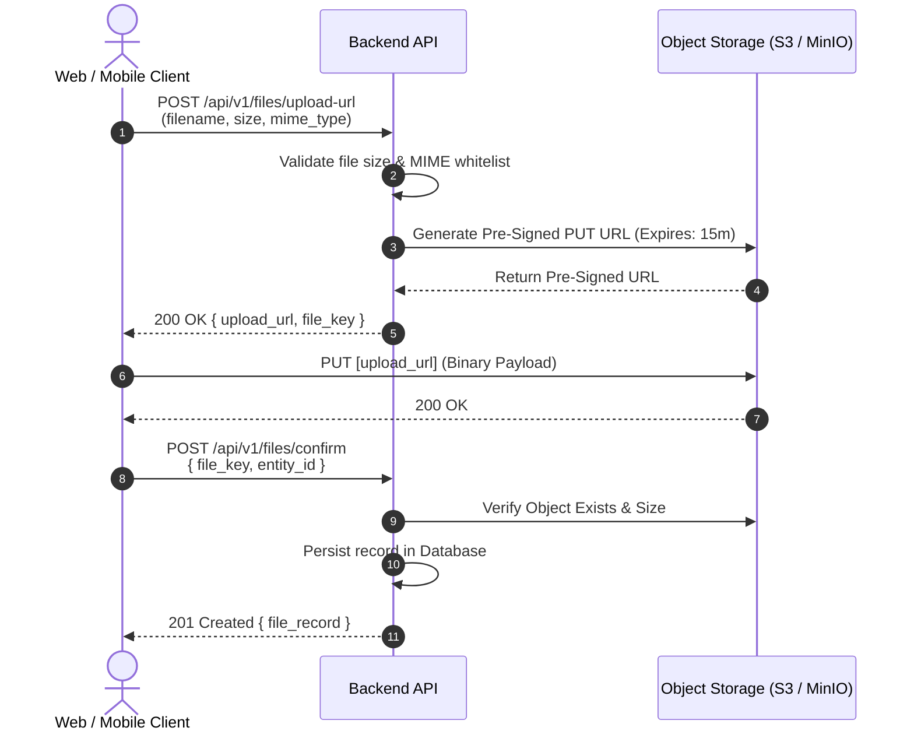

<!--
[AI AGENT DIRECTIVE: PRAGMATIC TEMPLATE ADAPTATION]
1. DOMAIN FIDELITY: This document is a structural and semantic guide. You MUST adapt all entities, terminology, state transitions, and architectures strictly to the USER'S ACTUAL SYSTEM DOMAIN. NEVER copy placeholder examples (e.g., e-commerce orders, payments) unless they are genuinely required by the user's domain.
2. PRAGMATIC PRUNING (YAGNI): Tailor depth and complexity to the project's scale. If a specific advanced architectural pattern (e.g., Table Partitioning, WebSockets, Circuit Breakers, Complex Multi-region DR) is demonstrably over-engineered for the current scope, explicitly mark it as "N/A - Omitted because [concrete technical reason]" rather than fabricating unnecessary complexity.
3. ZERO PLACEHOLDER LEAKS: Replace all [BRACKETED_PLACEHOLDERS] with real, concrete project data. Never leave unpopulated template tags in the final generated document.
-->

# API Specification & Interface Contracts: [PROJECT NAME]

> **Document Identifier**: API-[PROJECT]-001  
> **Document Version**: 1.0.0  
> **Standard Compliance**: OpenAPI Specification 3.1 & RFC 7807 (Problem Details for HTTP APIs)  
> **Protocol & Format**: HTTP/1.1 / HTTP/2, RESTful JSON  
> **Base URL**: `/api/v1`  
> **Derived From**: `docs/01-brd.md`, `docs/02-srs.md` & `docs/03-architecture.md`  
> **Status**: [Draft | In Review | Approved | In Progress]  
> **Lead API Architect / Backend Engineer**: [Name / Role]  
> **Last Updated**: [YYYY-MM-DD]  

---

### Document Control & Revision History

| Version | Release Date | Author / Contributor | Summary of Changes | Approval Status |
| :---: | :---: | :--- | :--- | :---: |
| **0.1** | [YYYY-MM-DD] | [Lead Backend Engineer] | Initial contract draft, standard envelopes, and resource definitions | Draft |
| **1.0** | [YYYY-MM-DD] | [Lead Backend Engineer] | API contracts locked and verified against functional requirements | Approved |

---

## 1. Global API Conventions, Transport & Security

### 1.1 Base URL & Content Negotiation
*   **Production Base URL**: `https://api.[domain].com/api/v1`
*   **Staging Base URL**: `https://staging-api.[domain].com/api/v1`
*   **Local / Development Base URL**: `http://localhost:8080/api/v1`
*   **Default Content-Type**: `application/json; charset=utf-8`
*   **Accept Header**: `application/json`

### 1.2 Authentication & Security Headers
*   **Bearer Authentication**: `Authorization: Bearer <jwt_access_token>`
*   **API Key Alternative (Service-to-Service)**: `X-API-Key: <secret_key>`
*   **End-to-End Request Tracing**: `X-Request-ID: <uuidv4>` (Mandatory. Generated by client or injected by edge reverse proxy).
*   **Idempotency (Mutating Operations)**: `Idempotency-Key: <uuidv4>` (Mandatory for non-idempotent mutations like payments or order checkout. Cached for 24 hours).
*   **Rate Limiting Standard Headers**:
    *   `X-RateLimit-Limit`: Maximum requests allowed in the current quota window.
    *   `X-RateLimit-Remaining`: Remaining request count within the quota window.
    *   `X-RateLimit-Reset`: Unix epoch timestamp when the quota resets.

### 1.3 CORS Policy & Header Exposure
To prevent client-side frontend/mobile runtimes from being blocked by browser sandbox restrictions, the backend reverse proxy and router MUST expose internal headers:

```http
Access-Control-Allow-Origin: https://[allowed-domain].com
Access-Control-Allow-Methods: GET, POST, PUT, PATCH, DELETE, OPTIONS
Access-Control-Allow-Headers: Authorization, Content-Type, Idempotency-Key, If-Match, If-None-Match, X-Request-ID
Access-Control-Expose-Headers: X-Request-ID, X-RateLimit-Limit, X-RateLimit-Remaining, X-RateLimit-Reset, ETag, Location, Sunset, Deprecation
Access-Control-Max-Age: 86400
```

---

## 2. Querying Standards: Pagination, Filtering, Sorting & Sparse Fields

### 2.1 Pagination Standards
All collection listing endpoints (`GET /api/v1/{resources}`) MUST support deterministic pagination:

*   **Offset-based Pagination (Standard Admin/Search Views)**:
    *   Parameters: `?page=1&limit=20` (Default: `page=1`, `limit=20`, Maximum `limit=100`).
*   **Cursor-based Pagination (High-Volume Feeds / Continuous Streaming)**:
    *   Parameters: `?cursor=<opaque_base64_token>&limit=20`
    *   Prevents skipped or duplicated records when items are inserted during pagination traversal.

### 2.2 Sorting Conventions
Sorting strictly follows the **JSON:API standard** to ensure deterministic multi-column precedence:

*   **Syntax**: `?sort=<field1>,-<field2>`
*   **Rule**: 
    *   Prefix with minus sign (`-`) denotes **Descending** order (`DESC`).
    *   No prefix denotes **Ascending** order (`ASC`).
    *   Comma-separated values dictate exact precedence order.
*   **Example**: `GET /api/v1/orders?sort=-created_at,price` (Sorts primarily by creation date newest first; ties broken by price lowest first).
*   **Security Guardrail**: Backend implementations MUST validate requested sort keys against an explicit whitelist of allowed database columns to prevent SQL injection or unindexed table scans.

### 2.3 Filtering Conventions
*   **Exact Equality**: `?status=PAID&category=electronics`
*   **Range Comparisons (Appended Operators)**:
    *   `_gte`: Greater than or equal to (`?created_at_gte=2026-01-01T00:00:00Z`)
    *   `_lte`: Less than or equal to (`?created_at_lte=2026-10-01T23:59:59Z`)
    *   `_in`: Set inclusion (`?status_in=PAID,PROCESSING`)
*   **Full-Text Search**: `?q=keyword` (Sanitized and delegated to tsvector or dedicated search index).

### 2.4 Sparse Fieldsets (Field Projection)
Allows mobile or bandwidth-constrained clients to request only required attributes:

*   **Syntax**: `?fields=id,order_number,total_amount`
*   **Backend Behavior**: Database query optimizes `SELECT` clauses to project only specified fields, minimizing network serialization and memory overhead.

---

## 3. Standardized Response & Error Envelopes

### 3.1 Unified Success Envelope
All successful responses (`2xx`) MUST wrap data in this standard structure:

```json
{
  "success": true,
  "data": {},
  "meta": {
    "page": 1,
    "limit": 20,
    "total": 100,
    "has_next": true,
    "next_cursor": null
  }
}
```
*Note: For single resource lookups (`GET /{resource}/{id}`) or non-paginated mutations, the `meta` object may be omitted or set to `null`.*  
*Standard Origin: Synthesized from the JSend specification (OmniTI) for unified client dispatching and the JSON:API standard (jsonapi.org top-level member specification separating core resource `data` from pagination/faceting `meta`).*

### 3.2 Unified Error Envelope (RFC 7807 Compliant)
All error responses (`4xx`, `5xx`) MUST conform to this RFC 7807 Problem Details structure:

```json
{
  "success": false,
  "error": {
    "code": "VALIDATION_FAILED",
    "message": "The request payload failed structural or semantic validation",
    "details": [
      {
        "field": "items[0].quantity",
        "issue": "must be greater than or equal to 1"
      }
    ],
    "request_id": "c4b3a210-9876-4abc-def0-123456789abc"
  }
}
```

### 3.3 HTTP Status Codes Matrix

| Status Code | Standard Meaning | Specific API Usage Scenario |
| :---: | :--- | :--- |
| **`200 OK`** | Request Succeeded | Successful `GET`, `PUT`, `PATCH`, or non-creation `POST` |
| **`201 Created`** | Resource Created | Successful `POST` creating an entity. Returns `Location` header |
| **`202 Accepted`** | Asynchronous Job Queued | Long-running task accepted for background processing |
| **`204 No Content`** | Action Completed | Successful `DELETE` or mutation returning empty body |
| **`304 Not Modified`** | Resource Unchanged | Conditional `GET` with matching `If-None-Match` (ETag) |
| **`400 Bad Request`** | Malformed Syntax | Malformed JSON syntax or missing mandatory headers |
| **`401 Unauthorized`** | Missing / Invalid Token | Missing, invalid, or expired Bearer JWT |
| **`403 Forbidden`** | Insufficient Rights | Authenticated user lacks RBAC role/scope for resource |
| **`404 Not Found`** | Resource Non-Existent | Specified resource ID does not exist |
| **`409 Conflict`** | State Conflict | Duplicate unique constraint (e.g., email already registered) |
| **`412 Precondition Failed`** | Concurrency Conflict | `If-Match` ETag mismatch (Lost Update prevention) |
| **`422 Unprocessable`** | Semantic Validation Failed | Well-formed JSON violating business validation logic |
| **`429 Too Many Requests`** | Rate Limit Exceeded | Client quota window exhausted. Returns `X-RateLimit-Reset` |
| **`500 Internal Error`** | Server Exception | Unhandled runtime panic/error. Masked from caller, logged |
| **`502 Bad Gateway`** | Upstream Failure | Dependent third-party service or payment gateway timeout |
| **`503 Service Unavailable`** | Service Overloaded / Down | System undergoing scheduled maintenance or database down |

### 3.4 Application-Specific Custom Error Code Dictionary
<!--
  MANDATORY: Map granular domain error codes (machine-readable string constants)
  to HTTP status codes, localized error messages, and expected client remediation actions.
  Prevents clients from parsing free-text error messages or guessing failure semantics.
-->

| Application Error Code | HTTP Status | User-Facing Message / Translation Key | Technical Cause & Trigger Scenario | Recommended Client Remediation |
| :--- | :---: | :--- | :--- | :--- |
| `VALIDATION_FAILED` | `422` | "The submitted form contains invalid values." | Request payload failed schema types, regex, or bounds validation. | Inspect `error.details` array and highlight specific UI fields. |
| `AUTH_INVALID_CREDENTIALS` | `401` | "Incorrect email or password." | Password hash mismatch or email not found during login. | Prompt user to re-enter credentials or initiate password reset. |
| `AUTH_TOKEN_EXPIRED` | `401` | "Your session has expired. Please log in again." | JWT `exp` timestamp is in the past. | Trigger background refresh token rotation (`POST /auth/refresh`). |
| `AUTH_INSUFFICIENT_SCOPE` | `403` | "You do not have permission to perform this action." | Authenticated user lacks required RBAC role or permission scope. | Display access denied UI; do not retry request. |
| `RESOURCE_NOT_FOUND` | `404` | "The requested resource could not be found." | Entity UUID does not exist or has been soft-deleted. | Redirect user to list view or display 404 placeholder screen. |
| `RESOURCE_ALREADY_EXISTS` | `409` | "An entity with these unique details already exists." | Violation of unique database constraints (e.g. duplicate email/code). | Inform user that duplicate exists; prompt to modify unique fields. |
| `INSUFFICIENT_INVENTORY` | `409` | "One or more items in your cart are currently out of stock." | Order checkout quantity exceeds current warehouse stock balance. | Prompt user to adjust item quantities before retrying checkout. |
| `CONCURRENCY_CONFLICT` | `412` | "This record was updated by someone else while you were viewing it." | `If-Match` ETag does not match current database row version. | Fetch latest version (`GET`), show diff to user, and re-apply edits. |
| `PAYMENT_GATEWAY_TIMEOUT` | `502` | "Payment processing temporarily timed out. Please check order status." | Upstream payment provider socket timed out after 3,000ms. | Poll order status (`GET /orders/{id}`) using `idempotency_key` without double charging. |
| `RATE_LIMIT_EXCEEDED` | `429` | "Too many requests. Please slow down and try again later." | Client exceeded token bucket quota window. | Wait until epoch specified in `X-RateLimit-Reset` header before retrying. |
| `INTERNAL_SERVER_ERROR` | `500` | "An unexpected error occurred. Our team has been notified." | Unhandled panic, database connection failure, or internal crash. | Display generic error modal with `request_id` for customer support lookup. |

---

## 4. Concurrency Control, HTTP Caching & API Lifecycle

### 4.1 Concurrency Control (Lost Update Prevention via ETags)
To prevent simultaneous client updates from overwriting each other (the "Lost Update" problem):

1.  **Response Generation**: Every `GET /api/v1/{resources}/{id}` includes an `ETag` response header containing a cryptographic hash or entity version counter:
    ```http
    HTTP/1.1 200 OK
    ETag: "v3-a8f5c2d1"
    ```
2.  **Conditional Mutation**: Mutating endpoints (`PUT`, `PATCH`) REQUIRE clients to send the current ETag:
    ```http
    PATCH /api/v1/orders/ORD-001
    If-Match: "v3-a8f5c2d1"
    ```
3.  **Conflict Resolution**: If the record was modified by another transaction in the interim, the backend rejects the request immediately with:
    ```http
    HTTP/1.1 412 Precondition Failed
    ```

### 4.2 HTTP Caching & Bandwidth Optimization
For read-heavy static or semi-static resources:
*   Header: `Cache-Control: private, max-age=120, must-revalidate`
*   Conditional Validation: Client sends `If-None-Match: "v3-a8f5c2d1"`. If unchanged, backend returns `304 Not Modified` with zero response body.

### 4.3 Versioning, Breaking Changes & Deprecation Policy
*   **Non-Breaking Changes (Released without version bump)**:
    *   Adding new optional query parameters.
    *   Adding new fields to existing response payloads.
    *   Adding new endpoints.
*   **Breaking Changes (Mandates `/api/v2` version bump)**:
    *   Renaming or deleting existing endpoint paths or response fields.
    *   Changing data types (e.g., string to integer).
    *   Adding new mandatory request body properties or headers.
*   **Deprecation Lifecycle (RFC 8594 Compliance)**:
    *   Deprecated endpoints MUST return standard headers alerting client SDKs:
        ```http
        Deprecation: @1771113600
        Sunset: Wed, 11 Nov 2026 00:00:00 GMT
        Link: <https://api.domain.com/docs/v2/migration>; rel="sunset"
        ```
    *   Deprecated versions remain active for a mandatory grace period of at least **6 months** prior to decommissioning.

---

## 5. Endpoint Specifications by Resource

### 5.1 Authentication Resource (`/api/v1/auth`)

#### `POST /api/v1/auth/login`
*   **Summary**: Authenticate credentials and issue JWT tokens.
*   **Traceability**: Mapped to `US-01` in `01-brd.md` and `FR-001` in `02-srs.md`.
*   **Authentication**: None (Public).
*   **Rate Limit**: 5 requests / minute / IP.

##### Request Body Schema:
```json
{
  "type": "object",
  "required": ["email", "password"],
  "properties": {
    "email": { "type": "string", "format": "email", "example": "engineer@domain.com" },
    "password": { "type": "string", "minLength": 8, "example": "SecureSecret123!" }
  }
}
```

##### Responses:
*   **`200 OK`**:
    ```json
    {
      "success": true,
      "data": {
        "access_token": "eyJhbGciOiJIUzI1NiIsIn...",
        "token_type": "Bearer",
        "expires_in": 900,
        "refresh_token": "def50200...",
        "user": {
          "id": "550e8400-e29b-41d4-a716-446655440000",
          "email": "engineer@domain.com",
          "role": "admin"
        }
      }
    }
    ```
*   **`401 Unauthorized`**: Invalid email or password.
*   **`422 Unprocessable Entity`**: Email format invalid.

---

### 5.2 Orders Resource (`/api/v1/orders`)

#### `POST /api/v1/orders`
*   **Summary**: Create a new customer order.
*   **Traceability**: Mapped to `US-02` in `01-brd.md` and `FR-003` in `02-srs.md`.
*   **Authentication**: Bearer Token required (`customer` or `admin`).
*   **Headers Required**: `Idempotency-Key: <UUID>`.

##### Request Body Schema:
```json
{
  "type": "object",
  "required": ["items"],
  "properties": {
    "items": {
      "type": "array",
      "minItems": 1,
      "items": {
        "type": "object",
        "required": ["product_id", "quantity"],
        "properties": {
          "product_id": { "type": "string", "format": "uuid" },
          "quantity": { "type": "integer", "minimum": 1 }
        }
      }
    }
  }
}
```

##### Responses:
*   **`201 Created`**:
    *   Header: `Location: /api/v1/orders/6ba7b810-9dad-11d1-80b4-00c04fd430c8`
    *   Header: `ETag: "v1-01J9AB"`
    ```json
    {
      "success": true,
      "data": {
        "id": "6ba7b810-9dad-11d1-80b4-00c04fd430c8",
        "order_number": "ORD-20261004-9812",
        "total_amount": 250000.00,
        "status": "PENDING",
        "created_at": "2026-10-04T08:00:00Z"
      }
    }
    ```
*   **`400 Bad Request`**: Missing `Idempotency-Key` header.
*   **`409 Conflict`**: Insufficient stock available.

---

#### `GET /api/v1/orders`
*   **Summary**: List and filter orders with sorting and pagination.
*   **Authentication**: Bearer Token required.
*   **Query Parameters**:
    *   `page` (integer, default: 1): Page index.
    *   `limit` (integer, default: 20, max: 100): Page limit.
    *   `sort` (string, default: `-created_at`): Sort expression (e.g., `?sort=-created_at,price`).
    *   `status` (string, optional): Filter by exact status (`PENDING`, `PAID`, `CANCELLED`).
    *   `fields` (string, optional): Comma-separated projection fields.

##### Response (`200 OK`):
```json
{
  "success": true,
  "data": [
    {
      "id": "6ba7b810-9dad-11d1-80b4-00c04fd430c8",
      "order_number": "ORD-20261004-9812",
      "total_amount": 250000.00,
      "status": "PAID",
      "created_at": "2026-10-04T08:00:00Z"
    }
  ],
  "meta": {
    "page": 1,
    "limit": 20,
    "total": 1,
    "has_next": false
  }
}
```

---

### 5.3 Bulk / Batch Operations (`/api/v1/orders/bulk-cancel`)

#### `POST /api/v1/orders/bulk-cancel`
*   **Summary**: Cancel up to 100 orders in a single request.
*   **Rate Limit**: 10 requests / minute.

##### Request Body Schema:
```json
{
  "type": "object",
  "required": ["order_ids", "reason"],
  "properties": {
    "order_ids": {
      "type": "array",
      "minItems": 1,
      "maxItems": 100,
      "items": { "type": "string", "format": "uuid" }
    },
    "reason": { "type": "string", "maxLength": 255 }
  }
}
```

##### Response (`200 OK` - Partial Failure Reporting):
```json
{
  "success": true,
  "data": {
    "succeeded": ["6ba7b810-9dad-11d1-80b4-00c04fd430c8"],
    "failed": [
      {
        "order_id": "7ca8b820-9dad-11d1-80b4-00c04fd430d9",
        "reason": "Order is already in SHIPPED status and cannot be cancelled"
      }
    ]
  }
}
```

---

### 5.4 Long-Running Asynchronous Jobs (`/api/v1/jobs`)

#### `POST /api/v1/reports/export`
*   **Summary**: Trigger heavy data export or analytics generation.
*   **Response (`202 Accepted`)**:
    *   Header: `Location: /api/v1/jobs/job_998123`
    *   Header: `Retry-After: 10`
    ```json
    {
      "success": true,
      "data": {
        "job_id": "job_998123",
        "status": "PENDING",
        "estimated_duration_seconds": 30
      }
    }
    ```

#### `GET /api/v1/jobs/{job_id}`
*   **Summary**: Poll asynchronous job status.
*   **Response (`200 OK`)**:
    ```json
    {
      "success": true,
      "data": {
        "job_id": "job_998123",
        "status": "COMPLETED",
        "progress_percentage": 100,
        "result": {
          "download_url": "https://storage.domain.com/exports/report_20261004.csv?token=..."
        },
        "completed_at": "2026-10-04T08:15:30Z"
      }
    }
    ```

---

## 6. File Transfer Architecture

### 6.1 Direct-to-Storage via Pre-signed URL (Standard Pattern)
Direct binary streaming through backend API gateways saturates server memory and thread pools. The direct-to-storage pattern is strictly enforced for files $> 5\text{ MB}$:



### 6.2 Multipart Form-Data (Small Asset Fallback)
*   **Application**: Permitted only for low-overhead files $< 5\text{ MB}$ (e.g., user avatar images).
*   **Endpoint**: `POST /api/v1/users/me/avatar`
*   **Content-Type**: `multipart/form-data`
*   **Security Restrictions**: Explicit validation of magic bytes (file signature), image dimensions, and strict MIME type checking (PNG, JPEG, WebP only).

---

## 7. Real-Time & Event Streaming: Webhooks, SSE & WebSockets

### 7.1 Outbound Webhooks (Server-to-Server Event Dispatch)
*   **Transport**: HTTPS POST to subscriber registered endpoint.
*   **Signature Verification**: Header `X-Signature-SHA256: <hmac_hex>` computed using `HMAC-SHA256(payload, shared_secret)`.
*   **Replay Attack Protection**: Header `X-Timestamp: <unix_epoch>`. Webhook receivers MUST reject events with timestamp skew $> 300\text{ seconds}$.
*   **Retry Policy**: Exponential backoff with jitter (immediate, 1m, 5m, 15m, 1h). Unsuccessful deliveries after 5 attempts transition to dead-letter queue.

#### Sample Webhook Event: `order.paid`
```json
{
  "event_id": "evt_01J9AB1234567890",
  "event_type": "order.paid",
  "occurred_at": "2026-10-04T08:05:00Z",
  "data": {
    "order_id": "6ba7b810-9dad-11d1-80b4-00c04fd430c8",
    "order_number": "ORD-20261004-9812",
    "amount_paid": 250000.00,
    "paid_at": "2026-10-04T08:05:00Z"
  }
}
```

---

### 7.2 Server-Sent Events - SSE (Unidirectional Server-to-Client Streaming)
*   **Primary Use Cases**: Live status updates, notification toasts, async job progress, and LLM text generation streaming.
*   **Endpoint Protocol**: `GET /api/v1/events/stream` (or `/api/v1/jobs/{id}/stream`)
*   **Transport Header**: `Content-Type: text/event-stream; charset=utf-8`
*   **Connection Headers**: `Cache-Control: no-cache`, `Connection: keep-alive`
*   **Framing Standard**:
    ```http
    event: job_progress
    id: 101
    data: {"job_id": "job_998123", "progress": 45, "status": "PROCESSING"}

    event: job_completed
    id: 102
    data: {"job_id": "job_998123", "progress": 100, "status": "COMPLETED", "download_url": "..."}

    : heartbeat ping (every 15s to keep proxy connection alive)
    ```
*   **Resilience**: Client automatically reconnects using `Last-Event-ID: 101` to resume uninterrupted from the exact stream offset.

---

### 7.3 WebSockets (Full-Duplex Bidirectional Real-Time)
*   **Primary Use Cases**: Interactive chat, real-time multiplayer state synchronization, collaborative whiteboards.
*   **Handshake Endpoint**: `GET /api/v1/ws` with `Upgrade: websocket`
*   **Authentication**: Authenticated via short-lived ticket token in query param: `wss://api.domain.com/api/v1/ws?ticket=<short_lived_token>`. (Avoid passing long-lived JWTs in URLs to prevent access log leakage).
*   **Message Protocol Framing (Unified JSON Envelope)**:
    All bidirectional WebSocket frames MUST follow this JSON schema:

    ```json
    {
      "action": "chat.send_message",
      "correlation_id": "req_uuid_1234",
      "payload": {
        "room_id": "room_888",
        "content": "Hello team"
      }
    }
    ```
*   **Heartbeat Standard**: Ping/Pong control frames exchanged every 30 seconds. Disconnect client after 2 missed Pong acknowledgments.
