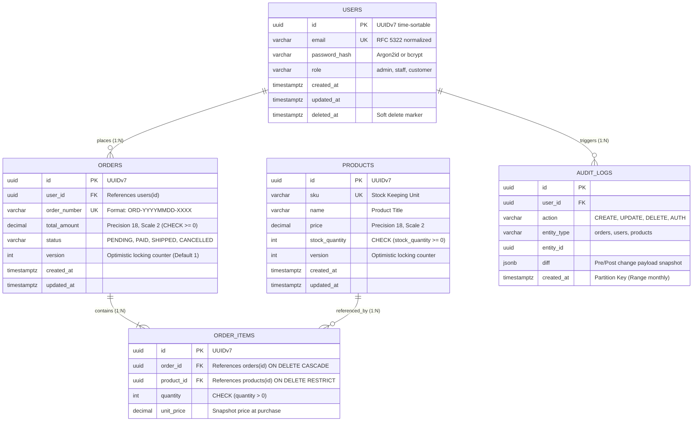

<!--
[AI AGENT DIRECTIVE: PRAGMATIC TEMPLATE ADAPTATION]
1. DOMAIN FIDELITY: This document is a structural and semantic guide. You MUST adapt all entities, terminology, state transitions, and architectures strictly to the USER'S ACTUAL SYSTEM DOMAIN. NEVER copy placeholder examples (e.g., e-commerce orders, payments) unless they are genuinely required by the user's domain.
2. PRAGMATIC PRUNING (YAGNI): Tailor depth and complexity to the project's scale. If a specific advanced architectural pattern (e.g., Table Partitioning, WebSockets, Circuit Breakers, Complex Multi-region DR) is demonstrably over-engineered for the current scope, explicitly mark it as "N/A - Omitted because [concrete technical reason]" rather than fabricating unnecessary complexity.
3. ZERO PLACEHOLDER LEAKS: Replace all [BRACKETED_PLACEHOLDERS] with real, concrete project data. Never leave unpopulated template tags in the final generated document.
-->

# Database Design Document (DBDD) & Schema Blueprint: [PROJECT NAME]

> **Document Identifier**: DBDD-[PROJECT]-001  
> **Document Version**: 1.0.0  
> **Standard Compliance**: IEEE 1016-2009 (Software Design Descriptions - Data Design)  
> **Target DBMS**: [e.g., PostgreSQL 16+ / MySQL 8.0+ / SQLite 3 (WAL mode)]  
> **Migration Tool**: [e.g., golang-migrate / sqlc / alembic / drizzle / prisma]  
> **Derived From**: `docs/01-brd.md`, `docs/02-srs.md`, `docs/03-architecture.md` & `docs/04-api.md`  
> **Status**: [Draft | In Review | Approved | In Progress]  
> **Lead Database Architect / Engineer**: [Name / Role]  
> **Last Updated**: [YYYY-MM-DD]  

---

### Document Control & Revision History

| Version | Release Date | Author / Contributor | Summary of Changes | Approval Status |
| :---: | :---: | :--- | :--- | :---: |
| **0.1** | [YYYY-MM-DD] | [Lead Database Engineer] | Initial ERD modeling, physical table definitions, and indexes | Draft |
| **1.0** | [YYYY-MM-DD] | [Lead Database Engineer] | Physical schema baseline locked with indexing, partitioning, and migration safety rules | Approved |

---

## 1. Database Overview, Engine Configuration & Connection Pooling

### 1.1 RDBMS Engine & Instance Parameters
*   **Engine & Version**: PostgreSQL 16.2+ (or target DBMS).
*   **Default Charset & Collation**: `UTF8` / `en_US.UTF-8`.
*   **Timezone Enforcement**: UTC (`SET timezone = 'UTC';` in session/init). All timestamps MUST be stored as `TIMESTAMPTZ`.

### 1.2 Connection Pooling & Query Protection Limits
To prevent database exhaustion during concurrent traffic spikes, the backend application connection pool (`pgxpool` for Go, `SQLAlchemy` for Python, `pg-pool` for Node) MUST adhere to these strict limits:

*   **Max Open Connections (`max_open_conns`)**: Sized according to Little's Law:
    $$\text{MaxConns} = \frac{\text{Target RPS} \times \text{Average Query Duration (seconds)}}{\text{App Instances}}$$
    *(Default: 20-30 connections per instance; total across instances must stay below database `max_connections - 15`)*.
*   **Max Idle Connections (`max_idle_conns`)**: Set to equal `max_open_conns / 2` to reduce connection churn.
*   **Connection Max Lifetime (`conn_max_lifetime`)**: `30 minutes` (recycles connections to avoid backend memory leaks or stale TCP handles).
*   **Connection Max Idle Time (`conn_max_idle_time`)**: `5 minutes`.
*   **Statement Timeout (`statement_timeout`)**: `3000ms` (3 seconds). Kills runaway unindexed queries before they starve server CPU/IO.
*   **Idle in Transaction Timeout (`idle_in_transaction_session_timeout`)**: `5000ms` (5 seconds). Automatically terminates transactions left open by crashed or hung backend goroutines/threads to prevent table lock pileups.

### 1.3 Naming Conventions
*   **Tables**: `snake_case`, pluralized (e.g., `users`, `orders`, `order_items`, `audit_logs`).
*   **Columns**: `snake_case` (e.g., `user_id`, `created_at`, `total_amount`).
*   **Primary Keys**: `id` (`UUIDv7` for time-sortable random identifiers, or `BIGSERIAL` / `INTEGER` for sequential surrogate keys).
*   **Foreign Keys**: `<singular_parent_table>_id` (e.g., `order_id`, `user_id`).
*   **Indexes**:
    *   Standard B-Tree: `idx_<table_name>_<column_names>`
    *   Unique Index: `uniq_<table_name>_<column_names>`
    *   Partial Index: `idx_<table_name>_<column_names>_<condition_summary>`
*   **Lifecycle Audit Columns**:
    *   `created_at`: `TIMESTAMPTZ NOT NULL DEFAULT CURRENT_TIMESTAMP`
    *   `updated_at`: `TIMESTAMPTZ NOT NULL DEFAULT CURRENT_TIMESTAMP`
    *   `deleted_at`: `TIMESTAMPTZ NULL` (for soft-deleted entities; indexed where active filtering occurs).

---

## 2. Logical Data Model (Mermaid ERD)



---

## 3. Physical Data Dictionary (Table Specifications)

### 3.1 Table: `users`
*   **Description**: Stores registered user identity, credentials, and RBAC authorization profiles.
*   **Traceability**: Mapped to `US-01` in `01-brd.md` and `FR-001` in `02-srs.md`.

| Column | Type | Nullable | Default | PK/FK/UK | Constraints & Description |
| :--- | :--- | :---: | :--- | :---: | :--- |
| `id` | `UUID` | No | `gen_random_uuid()` | PK | Unique identifier (UUIDv7 preferred) |
| `email` | `VARCHAR(255)` | No | None | UK | User login email, lowercase normalized |
| `password_hash` | `VARCHAR(255)` | No | None | - | Cryptographic hash (Argon2id or bcrypt) |
| `role` | `VARCHAR(32)` | No | `'customer'` | - | `CHECK (role IN ('customer', 'staff', 'admin'))` |
| `created_at` | `TIMESTAMPTZ` | No | `NOW()` | - | Account creation timestamp |
| `updated_at` | `TIMESTAMPTZ` | No | `NOW()` | - | Last modification timestamp |
| `deleted_at` | `TIMESTAMPTZ` | Yes | `NULL` | - | Soft-delete timestamp |

---

### 3.2 Table: `orders`
*   **Description**: Records purchase transactions placed by authenticated users.
*   **Traceability**: Mapped to `US-02` in `01-brd.md` and `FR-003` in `02-srs.md`.

| Column | Type | Nullable | Default | PK/FK/UK | Constraints & Description |
| :--- | :--- | :---: | :--- | :---: | :--- |
| `id` | `UUID` | No | `gen_random_uuid()` | PK | Unique transaction identifier |
| `user_id` | `UUID` | No | None | FK | `REFERENCES users(id) ON DELETE RESTRICT` |
| `order_number` | `VARCHAR(64)` | No | None | UK | Human-readable unique order code |
| `total_amount` | `DECIMAL(18,2)` | No | `0.00` | - | `CHECK (total_amount >= 0.00)` |
| `status` | `VARCHAR(32)` | No | `'PENDING'` | - | `CHECK (status IN ('PENDING', 'PAID', 'SHIPPED', 'CANCELLED'))` |
| `version` | `INTEGER` | No | `1` | - | Optimistic locking version counter |
| `created_at` | `TIMESTAMPTZ` | No | `NOW()` | - | Order submission timestamp |
| `updated_at` | `TIMESTAMPTZ` | No | `NOW()` | - | Status change timestamp |

---

### 3.3 Table: `order_items`
*   **Description**: Line items associated with each order, recording snapshot unit pricing.

| Column | Type | Nullable | Default | PK/FK/UK | Constraints & Description |
| :--- | :--- | :---: | :--- | :---: | :--- |
| `id` | `UUID` | No | `gen_random_uuid()` | PK | Unique line item ID |
| `order_id` | `UUID` | No | None | FK | `REFERENCES orders(id) ON DELETE CASCADE` |
| `product_id` | `UUID` | No | None | FK | `REFERENCES products(id) ON DELETE RESTRICT` |
| `quantity` | `INTEGER` | No | `1` | - | `CHECK (quantity > 0)` |
| `unit_price` | `DECIMAL(18,2)` | No | None | - | `CHECK (unit_price >= 0.00)` (Price snapshot) |

---

### 3.4 Table: `audit_logs` (Partitioned Candidate)
*   **Description**: High-velocity append-only trail recording state mutations and security operations.

| Column | Type | Nullable | Default | PK/FK/UK | Constraints & Description |
| :--- | :--- | :---: | :--- | :---: | :--- |
| `id` | `UUID` | No | `gen_random_uuid()` | PK | Composite PK with `created_at` |
| `user_id` | `UUID` | Yes | `NULL` | FK | Actor responsible for mutation |
| `action` | `VARCHAR(64)` | No | None | - | Action name (`ORDER_PAID`, `USER_LOGIN`) |
| `entity_type` | `VARCHAR(64)` | No | None | - | Target table/domain (`orders`, `users`) |
| `entity_id` | `UUID` | No | None | - | Target entity identifier |
| `diff` | `JSONB` | Yes | `NULL` | - | Pre/Post modification delta payload |
| `created_at` | `TIMESTAMPTZ` | No | `NOW()` | PK | **Partition Key** (Range partition by month) |

---

## 4. Transaction Isolation & Concurrency Locking Strategy

### 4.1 Isolation Levels
*   **Default Application Isolation**: `READ COMMITTED`.
    *   Sufficient for 95% of API operations. Prevents dirty reads while maintaining maximum throughput without serialization stalls.
*   **Critical Financial & Inventory Workflows**: Executed with explicit locking constructs within `READ COMMITTED` transactions to prevent non-repeatable reads and phantom anomalies.

### 4.2 Locking Strategy Comparison

| Workflow Type | Concurrency Mechanism | Implementation Pattern | Trigger Condition & Behavior |
| :--- | :--- | :--- | :--- |
| **High-Contention Checkout** | **Pessimistic Locking** (`SELECT ... FOR UPDATE`) | `SELECT stock_quantity FROM products WHERE id = $1 FOR UPDATE;` | Acquires exclusive row-level lock immediately. Upstream concurrent transactions queue until commit/rollback. |
| **Background Task Processing** | **Pessimistic Non-Blocking** (`SKIP LOCKED`) | `SELECT * FROM orders WHERE status = 'PENDING' LIMIT 10 FOR UPDATE SKIP LOCKED;` | Multiple worker processes consume jobs concurrently without locking conflicts or double-processing. |
| **Entity Mutation & Editing** | **Optimistic Locking** (`version` counter) | `UPDATE orders SET status = $1, version = version + 1 WHERE id = $2 AND version = $3;` | Returns row count. If 0 rows updated, abort transaction and return `412 Precondition Failed` to API. |

---

## 5. Indexing & Query Optimization Strategy

<!--
  Every index must be defended with an expected API access pattern and explain plan justification.
  Follow the ESR Rule (Equality, Sort, Range) for composite B-Tree indexes.
-->

### 5.1 Index Inventory

| Index Name | Table | Columns & Expressions | Type | Unique | Justification & Expected Query Pattern |
| :--- | :--- | :--- | :---: | :---: | :--- |
| `idx_users_email` | `users` | `email` | BTREE | Yes | Fast exact-match lookups during user login: `WHERE email = $1`. |
| `idx_orders_user_created` | `orders` | `(user_id, created_at DESC)` | BTREE | No | User order history filtered by user and sorted by date (ESR Rule: user_id [Equality], created_at [Sort]). |
| `idx_orders_pending_partial` | `orders` | `created_at` WHERE `status = 'PENDING'` | BTREE | No | **Partial Index**: Fast queue lookups for pending orders. 95% smaller than indexing entire table; zero overhead for completed orders. |
| `idx_users_active_lookup` | `users` | `email` INCLUDE (`id`, `role`, `password_hash`) WHERE `deleted_at IS NULL` | BTREE | No | **Covering Index**: Satisfies authentication queries entirely from index pages via **Index-Only Scan**, skipping heap table I/O. |
| `idx_order_items_order_id` | `order_items` | `order_id` | BTREE | No | Eliminates sequential table scans during foreign key joins: `FROM order_items WHERE order_id = $1`. |
| `idx_audit_logs_diff_gin` | `audit_logs` | `diff` | GIN | No | Enables fast JSONB path and attribute queries: `WHERE diff @> '{"field": "status"}'`. |

---

## 6. Table Partitioning & Data Lifecycle (Hot / Warm / Cold)

High-velocity append-only tables (such as `audit_logs`, `events`, or historical metric records) MUST implement declarative range partitioning to prevent table bloat and maintain query latency.

### 6.1 Declarative Partitioning Specification
```sql
-- Parent table partitioned by monthly range
CREATE TABLE audit_logs (
    id UUID NOT NULL DEFAULT gen_random_uuid(),
    user_id UUID,
    action VARCHAR(64) NOT NULL,
    entity_type VARCHAR(64) NOT NULL,
    entity_id UUID NOT NULL,
    diff JSONB,
    created_at TIMESTAMPTZ NOT NULL DEFAULT NOW(),
    PRIMARY KEY (id, created_at)
) PARTITION BY RANGE (created_at);

-- Monthly child partition examples
CREATE TABLE audit_logs_2026_10 PARTITION OF audit_logs
    FOR VALUES FROM ('2026-10-01 00:00:00+00') TO ('2026-11-01 00:00:00+00');

CREATE TABLE audit_logs_2026_11 PARTITION OF audit_logs
    FOR VALUES FROM ('2026-11-01 00:00:00+00') TO ('2026-12-01 00:00:00+00');
```

### 6.2 Data Retention & Tiering Policy

| Data Tier | Retention Window | Storage Medium | Operational Maintenance |
| :--- | :--- | :--- | :--- |
| **Hot Tier** | Current month to 90 days | High-speed NVMe primary database | Full write/read traffic, active indexes, autovacuum enabled. |
| **Warm Tier** | 90 days to 1 year | Read-only partitions / Compressed storage | Detached from hot transaction path. Queries isolated to analytics. |
| **Cold Tier** | > 1 year | S3 Object Storage (Parquet / Compressed CSV) | Drop partition from PostgreSQL (`DROP TABLE audit_logs_YYYY_MM`). Zero impact on database RAM/disk. |

---

## 7. Data Integrity, Cascade Rules & Constraints

### 7.1 Foreign Key Cascade Rules
*   **`orders` -> `users`**: `ON DELETE RESTRICT`. A user with active or historical purchase records cannot be deleted.
*   **`order_items` -> `orders`**: `ON DELETE CASCADE`. Removing an uncommitted draft order cascades to delete its associated line items.
*   **`order_items` -> `products`**: `ON DELETE RESTRICT`. A product linked to historical order items cannot be purged from the physical database.

### 7.2 Domain Check Constraints
*   `orders.total_amount >= 0.00`: Prohibits negative order totals.
*   `order_items.quantity > 0`: Prevents zero or negative line item quantities.
*   `products.stock_quantity >= 0`: Enforces physical warehouse inventory invariants.

### 7.3 Soft Deletion vs Hard Deletion Protocol
*   **Soft Deletion**: Applied to core entities (`users`, `products`) via `deleted_at TIMESTAMPTZ NULL`.
    *   Queries MUST include `WHERE deleted_at IS NULL` or utilize a database view `active_users`.
    *   Unique constraints on soft-deleted tables MUST be partial indexes:
        `CREATE UNIQUE INDEX uniq_users_email_active ON users(email) WHERE deleted_at IS NULL;`
*   **Hard Deletion**: Permissible only for transient session tokens, ephemeral cache tables, or when executing GDPR "Right to be Forgotten" mandates after anonymization.

---

## 8. Migration & Zero-Downtime Deployment Discipline

### 8.1 Migration File Conventions
All migrations are version-controlled, strictly sequential, and provide mutually reversible Up and Down SQL scripts:

```text
migrations/
├── 000001_create_users_table.up.sql
├── 000001_create_users_table.down.sql
├── 000002_create_orders_and_items.up.sql
├── 000002_create_orders_and_items.down.sql
├── 000003_add_orders_version_column.up.sql
└── 000003_add_orders_version_column.down.sql
```

### 8.2 Production Migration Safety Checklist
To avoid table-level locks (`AccessExclusiveLock`) that cause cascading connection timeouts and production outages, all migrations MUST adhere to this checklist:

1.  **Index Creation**: MUST ALWAYS use `CREATE INDEX CONCURRENTLY`. Never run standard `CREATE INDEX` on live tables.
2.  **Adding Columns with Defaults**: 
    *   In PostgreSQL 11+, `ALTER TABLE ... ADD COLUMN ... DEFAULT 'foo'` is metadata-only and safe.
    *   In older systems or complex volatile defaults (e.g., calling functions), add the column as `NULL` first, backfill in batches, then set the default and `NOT NULL` constraint.
3.  **Adding Constraints Safely**:
    *   Step 1: `ALTER TABLE orders ADD CONSTRAINT check_positive_total CHECK (total_amount >= 0) NOT VALID;` (Instantaneous, does not lock).
    *   Step 2: `ALTER TABLE orders VALIDATE CONSTRAINT check_positive_total;` (Validates rows without blocking concurrent reads or writes).
4.  **Column Renaming / Deletion (Expand and Contract)**:
    *   NEVER rename a column directly on a live database.
    *   Phase 1 (Expand): Add the new column, update application to write to both old and new columns.
    *   Phase 2 (Backfill): Backfill existing data from old to new column.
    *   Phase 3 (Contract): Update application to read/write only from new column. Drop old column in a subsequent release.

### 8.3 Initial Seeding Baseline
*   **System Roles**: Default roles inserted with deterministic UUIDs: `admin`, `staff`, `customer`.
*   **System Configuration**: Currency format, default UTC timezone, localized tax rules.
